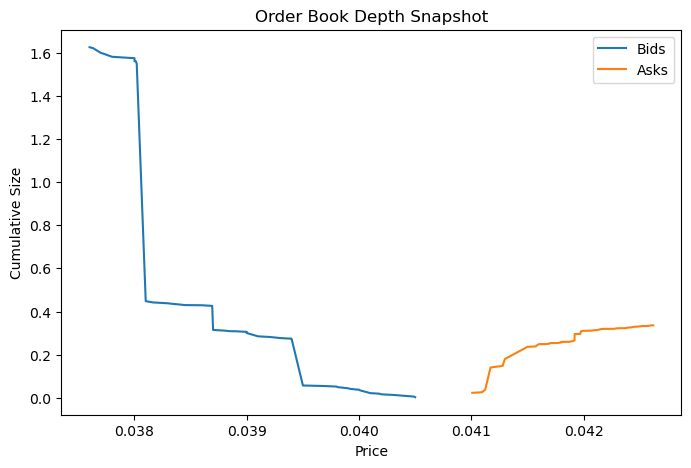
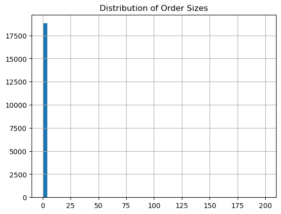
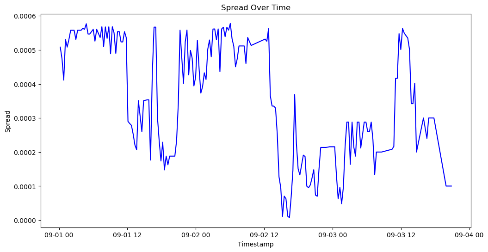
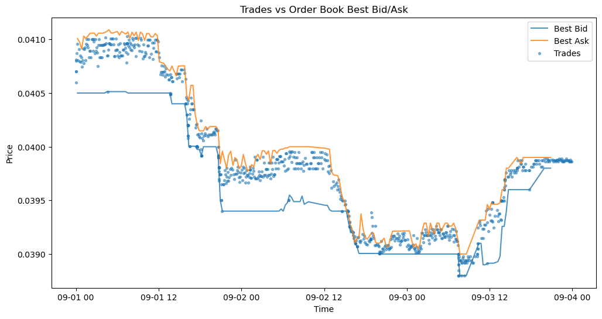

# Market Data Analysis for Suspicious Patterns

## 1. Dataset Overview

This report analyzes two datasets provided for the challenge:

- **eth-btc-orderbooks.csv** - snapshots of the order book containing bid and ask price levels with corresponding sizes.
- **eth-btc-trades.csv** - executed trades including timestamp, price, size, and trade side (BUY / SELL).

Both datasets cover the same time period, enabling a combined analysis of **displayed liquidity** in the order book and **actual executed trades**.

## 2. Order Book Analysis

### 2.1 Liquidity Concentration and Order Book Walls

Order book depth analysis reveals **strong liquidity concentration at specific price levels** on both the bid and ask sides. These concentrations form pronounced **order book walls**, while liquidity at neighboring price levels is significantly lower.

- A **large bid-side wall** is observed around the price level of approximately **0.038**.
- A **large ask-side wall** appears around **0.0398–0.0400**.

This uneven distribution suggests that liquidity is **not organically spread**, but instead clustered at selected prices.

### 2.2 Distribution of Order Sizes

The distribution of order sizes is highly skewed. A small number of sizes occur **very frequently and in large quantities**, while most other sizes are rare and small.

Such repetition of identical order sizes is characteristic of **algorithmic or strategic order placement**, rather than independent actions by many market participants.

### 2.3 Bid–Ask Spread Dynamics

The bid–ask spread over time shows **frequent sharp fluctuations**, resembling sudden expansions and contractions rather than smooth transitions.

This instability indicates **active adjustments of displayed liquidity**, which may reflect short-term strategic behavior instead of natural supply–demand changes.

## 3. Trade-Level Analysis

Trade-level statistics reveal **high variability in trade sizes**. While many trades are small, a number of **exceptionally large trades** significantly increase the overall variance.

Additionally, several trade sizes repeat multiple times, suggesting **non-random execution patterns**, potentially linked to automated strategies or internal matching mechanisms.

Despite the presence of large executed volumes, **price movement remains limited**, indicating a lack of proportional price impact.

## 4. Order Book vs. Trades

### 4.1 Execution at Order Book Walls

A direct comparison between order book liquidity and executed trades reveals a clear asymmetry:

- The **bid-side wall around ~0.038** is consistently visible in the order book, yet **no executed trades occur at or near this level**.  
  This suggests that the bid liquidity does **not represent genuine buying interest** and may exist solely to create the appearance of strong price support.

- The **ask-side wall around ~0.0398** is actively executed, with a large number of trades and **substantial cumulative volume**.  
  Despite this heavy execution, the price does not break out of the established range.

### 4.2 Trades Relative to Best Bid and Best Ask

When plotting executed trades together with the **best bid** and **best ask** prices over time, nearly all trades occur **within the corridor defined by these two levels**. Only a very small number of trades slightly cross these boundaries.

Even during periods of high trading volume, prices remain **confined within this narrow range**, suggesting that the bid and ask levels act as **effective price limits** rather than being organically breached by market activity.

This behavior is consistent with **price anchoring**, where displayed liquidity constrains price movement without reflecting true market intent.

## 5. Conclusion

The analysis identifies multiple indicators of **suspicious and irregular market behavior**:

- Large, concentrated order book walls dominate specific price levels.
- Bid-side walls are not supported by executed trades, indicating **artificial demand**.
- Ask-side walls are actively executed but do not lead to sustained price movement.
- Trade prices remain tightly constrained within a narrow corridor despite significant volume.

Taken together, these patterns are consistent with **artificial liquidity provisioning**, **price stabilization**, and potential **market manipulation**, rather than free and organic price discovery.
